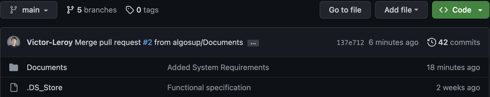
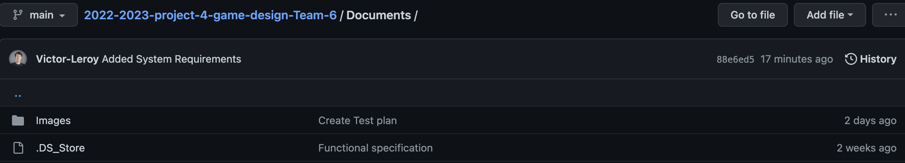
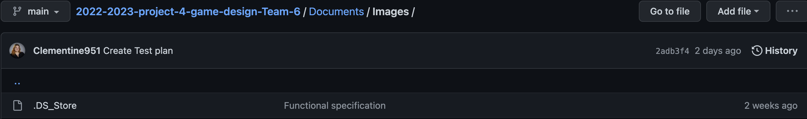

For more information on how it works: [Test plan](https://github.com/algosup/2022-2023-project-4-game-design-Team-6/blob/Documents/Documents/TestPlan.md)

|Index|Reporter|Date|Description|Component|Steps|Assignee|Severity|Additional content|Status|Solution|
|-|-|-|-|-|-|-|-|-|-|-|
|1|Clémentine|10/03|TheCardKingdom could not be compiled on MacOS|Unreal or MacOS issue|At the opening of the projet in UnReal|Clément|Medium||Cancel|Change the game compatibility to be just with windows|
|2|Clement|13/03|bug with the cards, switching continuously|Cards|put the cursor in the exact middle of two cards|Clement|Medium|-|Closed|Change the method of picking card|
|3|Clement|17/03|When you select a card and you tried to selecte another one, both of them are at the same place|Cards|You click on a card to select it -> it goes on the left -> you click on another card -> it goes on the left but the first one don't go at the original place|Clément|Medium|-|Closed||
|4|Clémentine|17/03|Wrong card selected when clicking on the blue part of a card|Cards|Click at the right of the number on the blue part of a card. It's the card under that are selected|Clément|None|-|Closed|Was the result of the previous method of choosing a card. The hit box of the cards have being deleted.|
|5|Clément|17/03|Instead of creating a tower, it creates a tower on every frame|Tower|Place a tower|Clément|Major|-|Closed||
|6|Clémentine|17/03|Multiple .DS_Store find in the GitHub|Documents|On the GitHub Main, and on the Document file, and on Document/Images|Victor|None||Closed|Victor delete the files and update the gitignore file.|
|7|Clément|21/03|The wrong tower place|Tower|Place a card to have a tower|Clément|Major|-|Closed||
|8|Clément|21/03|You can place a tower before selecting the card|Card/Tower|Click on the grid without selecting a card, then click on a card. A tower will appear at the location of the click on the grid|Clément|Medium|-|In progress||
||||||||||||
