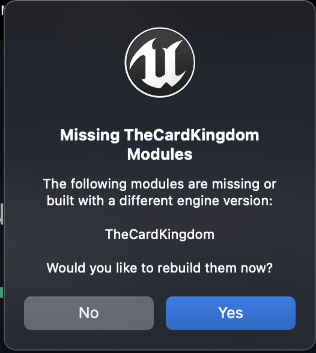
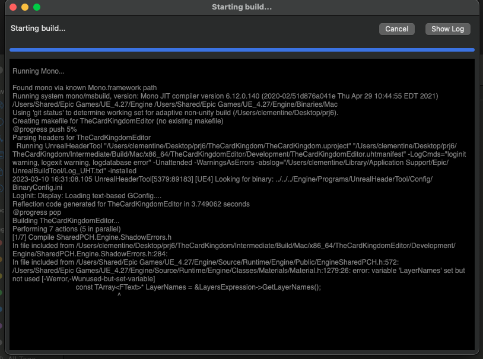
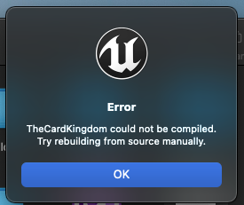

For more information on how it works: [Test plan](https://github.com/algosup/2022-2023-project-4-game-design-Team-6/blob/Documents/Documents/TestPlan.md)

|Index|Reporter|Date|Description|Component|Steps|Assignee|Status|Severity|Additional content|
|-|-|-|-|-|-|-|-|-|-|
|1|Clémentine|10/03|TheCardKingdom could not be compiled on MacOS|Unreal or MacOS issue|At the opening of the projet in UnReal|Clément|To do|Medium||
|2|Clement|13/03|bug with the cards, switching continuously|Cards|put the cursor in the exact middle of two cards|Clement|In progress|Medium|-|
|-|-|-|-|-|-|-|-|-|-|
