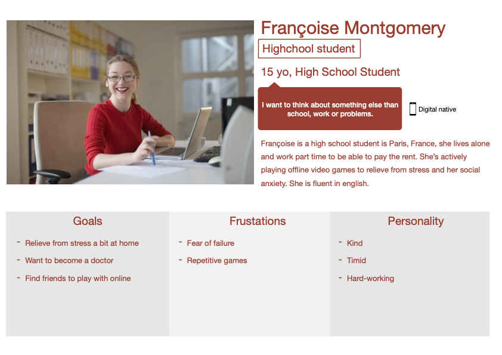
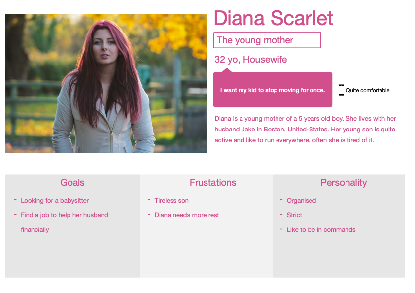
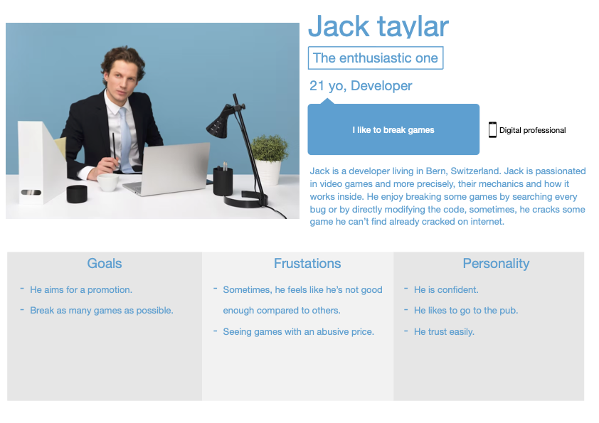
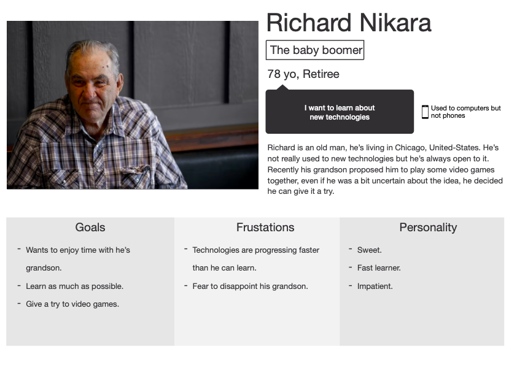
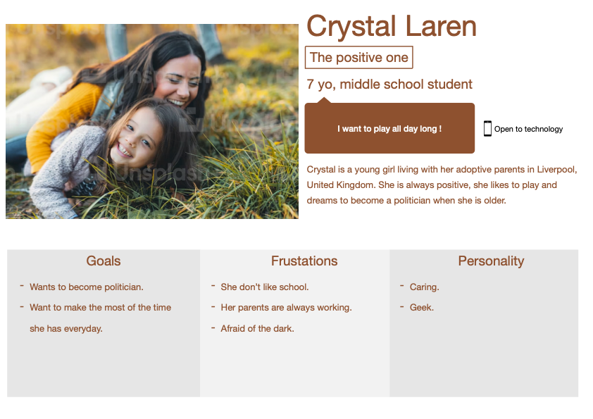

 Functional specifications 

 

 Aurélien Fernandez

 ALGOSUP, Group 6. All Rights Reserved.

# Summary

Table of content

- [Summary](#summary)
- [Overview](#overview)
- [Stakeholders](#stakeholders)
- [Personas](#personas)
- [Scenarios](#scenarios)
- [Functionnalities](#functionnalities)
  - [Mechanics](#mechanics)
  - [Design](#design)
  - [Mockups](#mockups)
- [Non-functionnal requirements](#non-functionnal-requirements)
- [Footnotes](#footnotes)

# Overview

The goal of this project is to create a video game with innovant ideas within 6 weeks.
The idea is to teach students principles of game design, during this project we will learn every fundamentals of creating a video game, from the creation of concepts to create the balance between every element.

To create a video game we will use multiple tools such as:

- Unreal Engine 4
- Modeling app such as blender
  
# Stakeholders

- ALGOSUP
- Users
  
# Personas

# Scenarios

Scenario 1: Françoise:
Françoise wants to relieve a bit from her stress, often she is playing some video games to do it, but she can't play long video games asking for her to play for multiple hours to finish because of her tight schedule.

As a student she is searching for a video game with a fast gameplay, it is even better if she can replay it as many time as she want as roguelikes[^roguelike] or roguelites[^roguelite] tends to do.

Scenario 2: Diana:
Diana is searching for a solution to make her kid calmer, she will give her child our game. Being a young age the kid will try to understand by clicking everywhere.

The child is searching for something fun to do and something not too hard for him to play.

Scenario 3: Jack:
Jack is a young developper who enjoys displaying his skills, it often results on breaking some video games' code or even playing some of his friend computer by using USB sticks or controling them remotely. He is doing this for fun, not for malevolent purposes but it often frighten his friends.

Jack may want to break our game by any means possible, so we have to pay attention to as many bugs or breach we might find during the development of the game.

Scenario 4: Richard:
Richard is still learning about new technologies, he has more knowledge than most people of his age but he's not at the same level of understanding as youngs. His grandson invited to play with him on some videogames and to do so he decided to train himself to this specific type of interfaces, he is learning about games genres and how to play.

Richard is currently searching for some roguelite to play, to help people like him, who are not used to video games we must have an intuitive interface, for them to understand how to play.

Scenario 5: Crystal:
Crystal is a young girl who's only desire is to play all the time, it can be board games, video games or simply outdoor games. She prefer simples games where she don't have to think  to play, so games like chess are a no go for her.

# Functionnalities

## Mechanics

Our team is searching for innovative ideas, to attain them we wanted to aim to a new type of gameplay, our game is a tower defence game mixed with a roguelite[^roguelite] style, the user is defending his castle with the same mechanics as a standard tower defence but using a system of card and deck.

To explain a bit further, the user have a hand of card, generated randomly after each waves in a level depending of user's deck. To use it's card, the user will have to use he's mana, a ressource refilled as the same time as the hand.

The user will be able to place his towers on the map which is cut into a grid, he can also upgrade his towers and even give a bonus to them. By placing towers the user will be able to create a maze to make ennemies' advance longer and more difficult.

Furthermore, the levels will be chosen by the user by using a procedural[^procedural] generation for the list of levels.
## Design

## Mockups

The image below is showing the interface during the play phase, on the bottom you can observe player's hand of card, on the right it's pile and on the left the discard pile, as the norm dictates.

On the middle you can see the grid, this is wahere players can use their card and create their maze, naturally this is where ennemies will appear and this is where they will be marching toward the castle.

Now, for the interface part, on the castle's left you can see the player's mana, on the top, you can see as it follows : the artifact inventory, the number of wave and finaly the pause button.

Finally on the left of the card you may have noticed there is a grey square, it is where we will put an almanach, it is a book to describe towers' and ennemies' features and, if we have the time, their lore[^lore].

<!-- ### Menu

### Playable stages

### "resting" stages -->

# Non-functionnal requirements

- The player should be able to save it's advancement to resume later.
- The interface have to be clear enough for children to understand.
- The game must be responsive[^responsive] for all kind of computer screen (laptop, desk computer), with an acceptable resolution (the test must be readable)

# Footnotes
[^lore]: The story, a character's lore is the story of the character, it can also define the main story for a movie, a book or a game.
[^roguelite]: It is a lighter version of the roguelike genre.
[^roguelike]: As the name suggest, it is a genre of game based on the gameplay of the game "Rogue" a video game from 1980, in this game the user axplore a dungeon where monsters lurk in the dark, the user have to find object to help him finishing the game, most of the time this genre is associated with procedural maps.
[^procedural]: A procedural generation is a randomly generated system, it is used to generate the terrain, the list of level or even encounters.
[^responsive]: A responsive app is an app which is able to scale to every screen size of it's plateform, for example responsive website are website able to perform for every computers and/or phones without having issues with their apparence.
