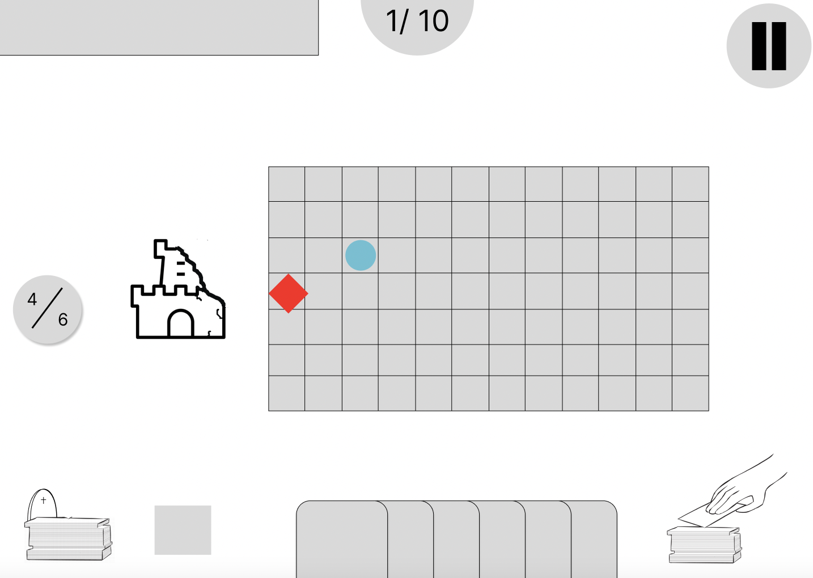

 Functional specifications 

 

 Aurélien Fernandez

 ALGOSUP, Group 6. All Rights Reserved.

# Summary

Table of content

- [Summary](#summary)
- [Overview](#overview)
- [Game overview](#game-overview)
  - [Story](#story)
  - [Mechanics](#mechanics)
  - [Gameplay](#gameplay)
        - [Setup phase](#setup-phase)
        - [Play phase](#play-phase)
  - [Design](#design)
    - [Graphic style](#graphic-style)
      - [Description](#description)
      - [examples](#examples)
        - [Archer tower](#archer-tower)
        - [Skeleton enemy](#skeleton-enemy)
        - [Castle](#castle)
    - [Mockup](#mockup)
  - [Course of a game](#course-of-a-game)
        - [When the players starts the game:](#when-the-players-starts-the-game)
        - [When the players starts a new game](#when-the-players-starts-a-new-game)
  - [Visuals of a game's course](#visuals-of-a-games-course)
    - [Main menu](#main-menu)
    - [Setup phase - without actions](#setup-phase---without-actions)
    - [Setup phase - Selecting a card](#setup-phase---selecting-a-card)
    - [Setup phase - Selecting and placing a tower](#setup-phase---selecting-and-placing-a-tower)
    - [Setup phase - A tower is placed in the middle](#setup-phase---a-tower-is-placed-in-the-middle)
    - [Battle phase - Ennemies appear](#battle-phase---ennemies-appear)
    - [Battle phase - Castle takes damages](#battle-phase---castle-takes-damages)
- [Non-functionnal requirements](#non-functionnal-requirements)
- [Footnotes](#footnotes)

# Overview

The goal of this project is to create a video game with innovant ideas within 6 weeks.
The idea is to teach students principles of game design, during this project we will learn every fundamentals of creating a video game, from the creation of concepts to create the balance between every element.

To create a video game we will use multiple tools such as:

- Unreal Engine 4
- Modeling app such as blender
  
As for the audience we are aiming, we are aiming for every type of users, from 8 years old to 80 years old. However if you want more specific informations here is a document that will present them: [Personas](./Personas.md)

# Game overview

## Story

The story takes place in a fantasy world, humans are the most dominant species, goblins, orcs, phantoms, and countless creatures can be found, but beware, they are lurking in the dark, waiting for the long-desired moment where they can crush all civilization and hope. You are the king, head of your country and its armies, you will have to defend your glorious kingdom against endless waves of monsters and sometimes traitors, but you are not alone, powerful artifacts will lead your way during this journey, defend your kingdom and your people my king, may the gods be with you.

## Mechanics

Our team is searching for innovative ideas, to attain them we wanted to aim to a new type of gameplay, our game is a tower defence game mixed with a roguelite[^roguelite] style, the user is defending their castle with the same mechanics as a standard tower defence but using a system of cards and deck.

To explain a bit further, the user have a hand of cards, generated randomly after each waves in a level depending of user's deck. To use their cards, the user will have to use their mana, a ressource refilled as the same time as the hand.

The user will be able to place their towers on the map which is cut into a grid, they can also upgrade their towers and even give a bonus to them. By placing towers the user will be able to create a maze to make ennemies' advance longer and harder.

Furthermore, the levels will be chosen by the user by using a procedural[^procedural] generation for the list of levels.

## Gameplay

The gameplay was made to be simple to grasp within short time, the battle phase is cut in two different part, the setup and the play phase.

##### Setup phase

The setup phase is, as its name suggest a moment where the players are able to setup their towers. At the start of the phase the players will see their mana refilled, gain one additional mana and will have 5 more cards in their hand. At this moment the players will have to think about how to use their mana to place towers on the grid, (e.g: the players have an archer tower and a crossbow tower, they cost 2 and 3 respectively but the players only have 4 mana, they need to choose which tower they will place or use none of them). Something to note is that during this phase, the view automatically transform to an aerial view.

Something to note is that at the start of the first wave the players have only 3 mana and as said previously after each wave the players gain 1 additional mana until 10 mana maximum.

When the players have finished their preparations they can push the button "new wave" and the battle phase starts, making the camera come back to an isometric view.

At the end of the phase the players keep their cards, however, they can hold until 20 cards maximum, if the players have their hand full, new cards directly go to the discard pile, to avoid the players to be stuck, they can send directly card in their hand to the discard pile for free.

Finally if the players's deck is empty, their discard pile is shuffled and put back in the pile.

##### Play phase

The play phase represent the phase where ennemies are coming, the towers attack nearby ennemies and the phase ends when all ennemies are killed, except for boss battles, if the boss is not killed after a certain amount of time, it calls reinforcement and every ennemies are twice as fast, it is to avoid a battle phase that last longer than expected. Finaly, during this phase, the players can use their remaining mana to use spell cards that they can temporarily enhance towers, slow or hurt ennemies.

## Design

### Graphic style

#### Description

Our game will use a style named "paper style", every thing is represented as papers and drawings, for example an enemy is a drawing standing on a stick, the castle is a card castle, and mana are small paper balls.

#### examples

##### Archer tower

##### Skeleton enemy

##### Castle

### Mockup

The image below is showing the interface during the play phase, on the bottom you can observe players's hand of card, on the right it's pile and on the left the discard pile, as the norm dictates.

On the middle you can see the grid, this is where players can use their cards and create their maze, naturally this is where ennemies will appear and this is where they will be marching toward the castle.

Now, for the interface part, on the castle's left you can see the players's mana, on the top, you can see as it follows : the artifact inventory, the number of wave, the pause button and finaly under the pause button there is a "new wave" button, this button ends the setup phase, hovering it reveal which monsters will come and how many of them there will be.

Finally on the left of the card you may have noticed there is a grey square, it is where we will put an almanach, it will contain a description of the towers' and  the ennemies' features and, if we have the time, their lore[^lore].

## Course of a game

##### When the players starts the game:

- The players open the executable
- The players arrive on the main menu
- The players select "new game"
  
##### When the players starts a new game

- The players arrive on the playable scene
- The setup phase starts, the view is now aerial
- The players use all their mana to place archer towers
- The players push the "new wave" button"
- The players sucessfully kill all of the ennemies
- The setup phase come back, all their mana is refilled, the players now have 5 cards
- The players push the "new wave" button
- An ennemies sucessfuly pass through the players defenses and arrive at the castle, the players loose
- The players come back to the main menu

## Visuals of a game's course

### Main menu

### Setup phase - without actions

### Setup phase - Selecting a card

### Setup phase - Selecting and placing a tower

### Setup phase - A tower is placed in the middle

### Battle phase - Ennemies appear

### Battle phase - Castle takes damages

# Non-functionnal requirements

- The interface have to be clear enough for children to understand.
- The game must be responsive[^responsive] for all kind of computer screen (laptop, desk computer), with an acceptable resolution (the test must be readable)

# Footnotes

[^lore]: The story, a character's lore is the story of the character, it can also define the main story for a movie, a book or a game.
[^roguelite]: It is a lighter version of the roguelike[^roguelike] genre.
[^roguelike]: As the name suggest, it is a genre of game based on the gameplay of the game "Rogue" a video game from 1980, in this game the user axplore a dungeon where monsters lurk in the dark, the user have to find object to help him finishing the game, most of the time this genre is associated with procedural maps.
[^procedural]: A procedural generation is a randomly generated system, it is used to generate the terrain, the list of level or even encounters.
[^responsive]: A responsive app is an app which is able to scale to every screen size of it's plateform, for example responsive website are website able to perform for every computers and/or phones without having issues with their apparence.
