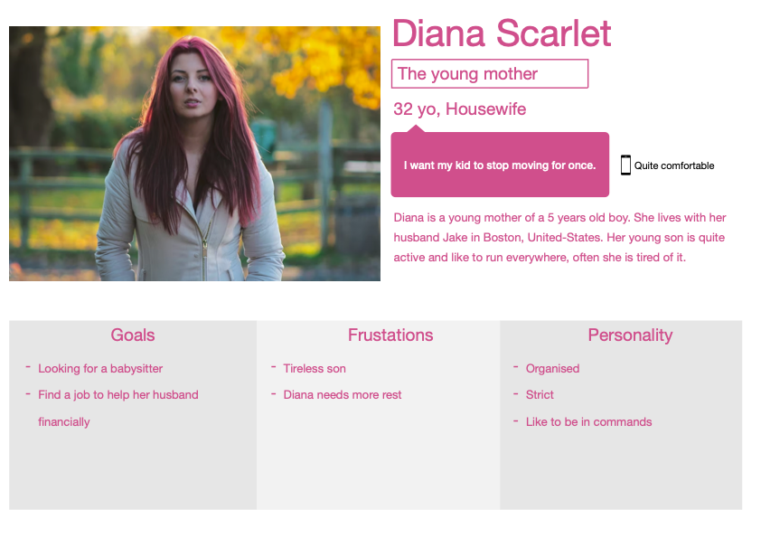
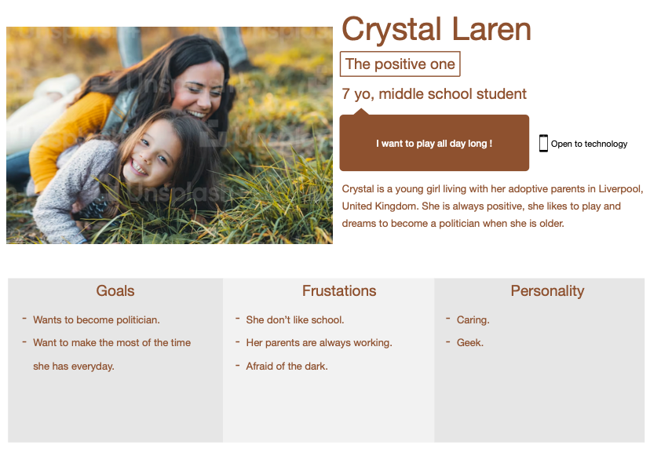

# Personas

## Overwiew

This document is made to give some personas for potential readers, as we aim our game for every type of users we didn't think it would be useful to put this inside the functional, however we created this document in case readers prefer something more explicit.

## Personas

## Scenarios

Scenario 1: Françoise:
Françoise wants to relieve a bit from her stress, often she is playing some video games to do it, but she can't play long video games asking for her to play for multiple hours to finish because of her tight schedule.

As a student she is searching for a video game with a fast gameplay, it is even better if she can replay it as many time as she want as roguelikes[^roguelike] or roguelites[^roguelite] tends to do.

Scenario 2: Diana:
Diana is searching for a solution to make her kid calmer, she will give her child our game. Being a young age the kid will try to understand by clicking everywhere.

The child is searching for something fun to do and something not too hard for him to play.

Scenario 3: Jack:
Jack is a young developper who enjoys displaying his skills, it often results on breaking some video games' code or even playing some of his friend computer by using USB sticks or controling them remotely. He is doing this for fun, not for malevolent purposes but it often frighten his friends.

Jack may want to break our game by any means possible, so we have to pay attention to as many bugs or breach we might find during the development of the game.

Scenario 4: Richard:
Richard is still learning about new technologies, he has more knowledge than most people of his age but he's not at the same level of understanding as youngs. His grandson invited to play with him on some videogames and to do so he decided to train himself to this specific type of interfaces, he is learning about games genres and how to play.

Richard is currently searching for some roguelite to play, to help people like him, who are not used to video games we must have an intuitive interface, for them to understand how to play.

Scenario 5: Crystal:
Crystal is a young girl who's only desire is to play all the time, it can be board games, video games or simply outdoor games. She prefer simples games where she don't have to think  to play, so games like chess are a no go for her.

## Footnotes

[^roguelike]: As the name suggest, it is a genre of game based on the gameplay of the game "Rogue" a video game from 1980, in this game the user axplore a dungeon where monsters lurk in the dark, the user have to find object to help him finishing the game, most of the time this genre is associated with procedural maps.
