

**
The Card Kingdom
**
**
Test Cases
**

Clémentine Curel

 

**
Team:
**

Jason GROSSO, Aurélien Fernandez, Victor LEROY, Clément CATON

 

 ALGOSUP, Group 6. All Rights Reserved. 

Table of content

- [Test Cases](#test-cases)
  - [Cards Navigation 001](#cards-navigation-001)
  - [Place Tower Card 002](#place-tower-card-002)
  - [Enemies Coming 003](#enemies-coming-003)
  - [Enemies path 004](#enemies-path-004)
  - [Tower Attacks 005](#tower-attacks-005)
  - [Castle destroy 006](#castle-destroy-006)
  - [Pause Test 007](#pause-test-007)
  - [Keyboard Test 008](#keyboard-test-008)
  - [Place Spell Card 09](#place-spell-card-09)
  - [Get New Cards 010](#get-new-cards-010)
  - [Damage saved 011](#damage-saved-011)
  - [Mana Management 012](#mana-management-012)
  - [Menu Navigation 013](#menu-navigation-013)

# Test Cases

## Cards Navigation 001 

**Test Case ID**: 001

**Test Title**: Cards navigation

**Environment**: UnReal 4.27

**Preconditions**: Load into the game with the following settings: Wave 1, set-up phase

**Test Steps**:

|Step|Instructions|Expected behaviour|Version working|
|----|------------|------------------|------|
|1|Observe the cards **without touching** them|Nothing should happen|0.8.0|
|2|**Left** click on the first card (**short press**)|The card should teleport itself to the middle left of the screen and be bigger|0.8.0|
|3|**Left** click on the same card (**short press**)|The card must return to its initial place and be smaller|0.8.0|
|4|**Right** click on a card (**short press**)|The card should do nothing|0.8.0|
|5|**Left** click on the last card (**short press**)|The card should teleport itself to the middle left of the screen and be bigger|0.8.0|
|6|**Left** click on another card (**short press**)|The first card must return to its initial place and be smaller. The second card must be at the middle right of the screen and be bigger|0.8.0|
|7|**Hovering** the card with the cursor|Nothing should happen|0.8.0|
|8|**Left** click on a card (**long press**)|The card should teleport itself to the middle left of the screen and be bigger|0.8.0|
|9|**Left** click on another card (**long press**)|The first card must return to its initial place and be the same size as the other. The second card must be at the middle left of the screen and be bigger|0.8.0|
|10|**Left** click on the card selected(on left)(**long press**)|The card must return to its original place and have its original size|0.8.0|
|11|**Double left** click on a card with a card under|The first card must go to the middle left and be bigger, followed by the card under, and the first card should return to its initial place with its initial size|0.8.0|
|12|**Double left** click on the selected card|The card must return to its initial place with the initial size|0.8.0|
|13|**Double left** click on a card with no card under|The card must go to the left and be bigger|0.8.0|

**Expected Results**: All actions should result in the expected movements without unwanted behaviour.

##  Place Tower Card 002

**Test Case ID**: 002

**Test Title**: Place tower card

**Environment**: UnReal 4.27

**Preconditions**: Load into the game with the following settings: Wave 1, set-up phase

**Test Steps**:

|Step|Instructions|Expected behaviour|Status|
|----|------------|------------------|------|
|1|**Left** click on a card (**short press**)|The card should teleport itself to the middle right of the screen and be bigger|0.8.0|
|2|**Hovering** the grid|Nothing will happen|0.8.0|
|3|**Left** click on a random case on the grid(**short press**)|A tower must appear in the case clicked|0.8.0|
|4|**Left** click on a card|The card should teleport itself to the middle right of the screen and be bigger|0.8.0|
|5|**Left** click on the previous case occupied by a tower| Nothing should happen|0.8.0|
|6|**Left** click on a random case of the grid|A tower must appear in the case clicked|0.8.0|
|7|Try to **drag** a tower|Nothing should happen|0.8.0|
|8|**Left** click on a tower|Nothing should happen|0.8.0|
|9|**Double left** click on a tower|Nothing should happen|0.8.0|
|10|**Right** click on a tower|Nothing should happen|0.8.0|

**Expected Results**: All actions should result in the expected movements without unwanted behaviour.

## Enemies Coming 003

**Test Case ID**: 003

**Test Title**: Enemies coming

**Environment**: UnReal 4.27

**Preconditions**: Load into the game with the following settings: Wave 1, set-up phase without a tower

**Test Steps**:

|Step|Instructions|Expected behaviour|Status|
|----|------------|------------------|------|
|1|**Right** click on the play button|Nothing should happen|To do|
|2|**Left** click on the play button|Sounds to let us know it starts, five new cards appear on your deck|To do|
|3|**Wait** and click on **nothing**|The enemies should start to arrive|To do|
|4|**Left** click on enemies|Nothing should change. The enemies should continue to move straight forward and disappear when leaving the grid|To do|
|5|**Double left** click on enemies|Nothing should change. The enemies should continue to move straight forward and disappear when leaving the grid|To do|
|6|**Right** click on enemies|Nothing should change. The enemies should continue to move straight forward and disappear when leaving the grid|To do|

**Expected Results**: All actions should result in the expected movements without unwanted behaviour.

## Enemies path 004

**Test Case ID**: 004

**Test Title**: Enemies path

**Environment**: UnReal 4.27

**Preconditions**: Load into the game with the following settings: Wave 1, set-up phase

**Test Steps**:

|Step|Instructions|Expected behaviour|Status|
|----|------------|------------------|------|
|1|**Place** tower like that 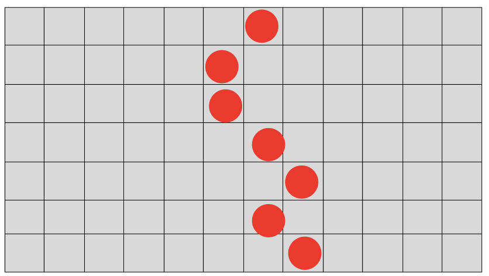 And click on the play button|You musn't be able to do it|To do|
|2|**Reload** the game then **place** tower like that 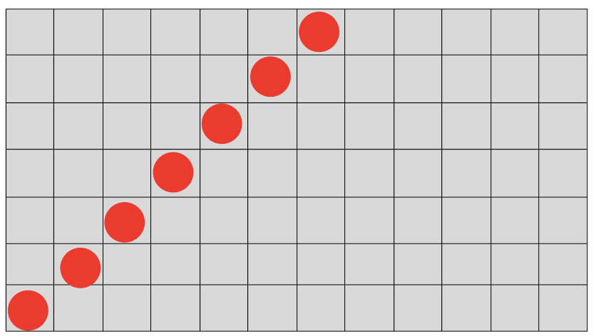 And click on the play button|You musn't be able to do it|To do|
|3|**Reload** the game then **place** tower like that 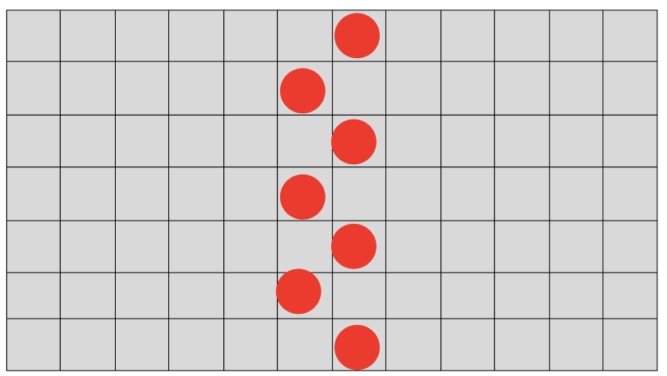 And click on the play button|You musn't be able to do it|To do|
|4|**Reload** the game then **place** tower like that 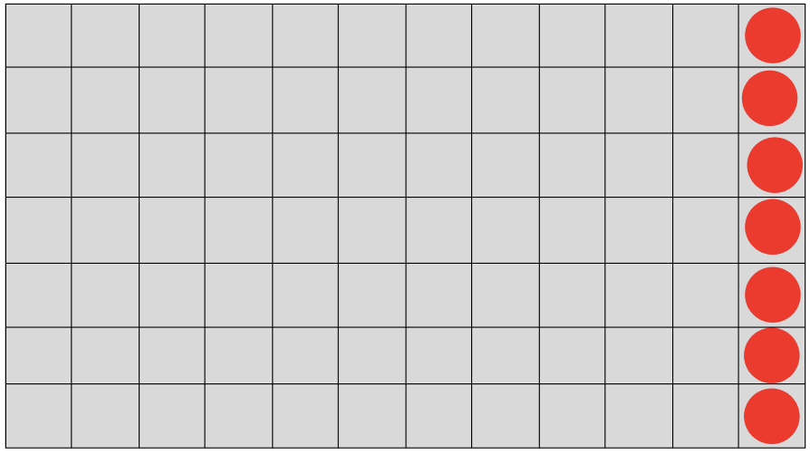 And click on the play button|You musn't be able to do it|To do|
|5|**Reload** the game then **place** tower like that  And click on the play button|You musn't be able to do it|To do|
|6|**Reload** the game and **place** tower like that 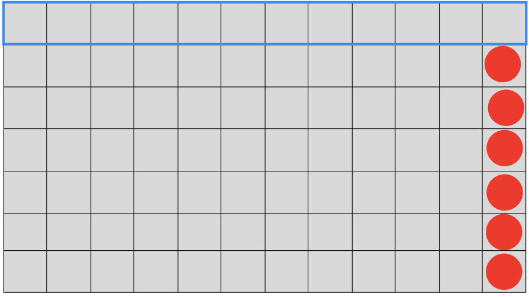 And click on the play button|The enemies should follow the arrow 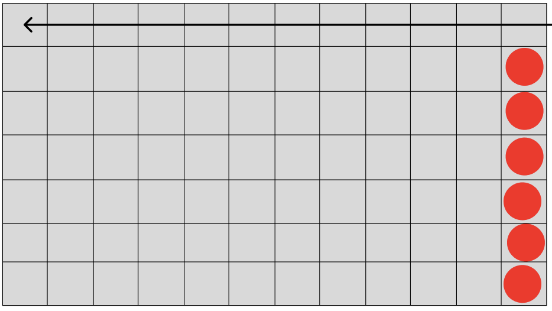|To do|
|7|**Reload** the game then **place** tower like that 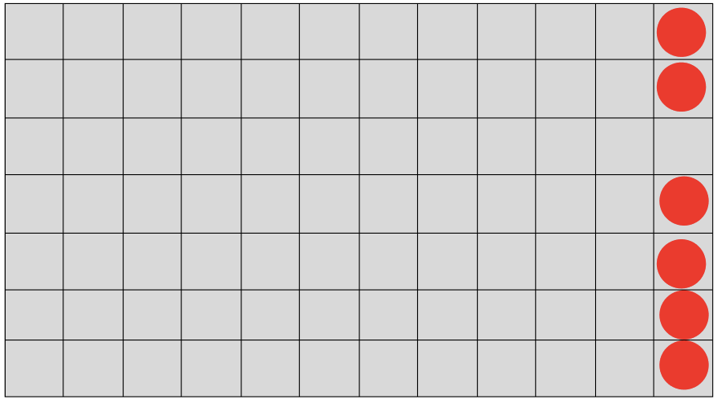 And click on the play button|The enemies should follow the arrow 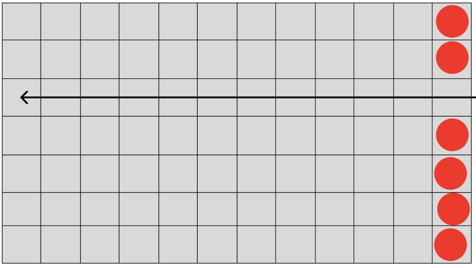|To do|
|8|**Reload** the game then **place** tower like that 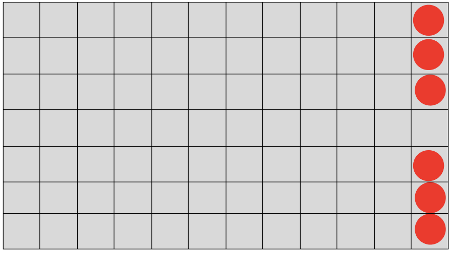 And click on the play button|The enemies should follow the arrow 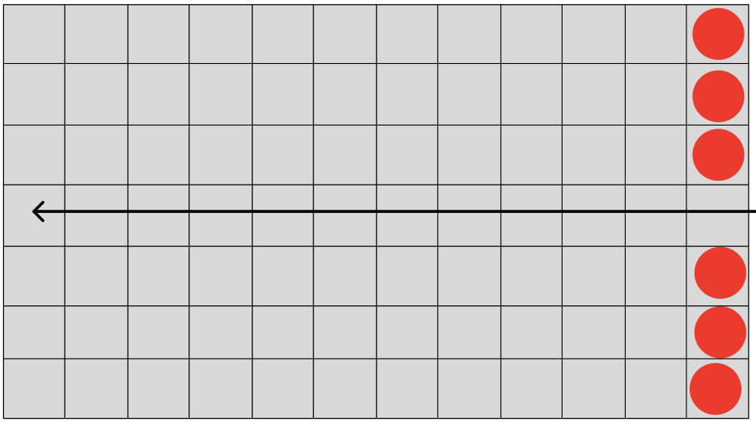|To do|
|9|**Reload** the game then **place** tower like that 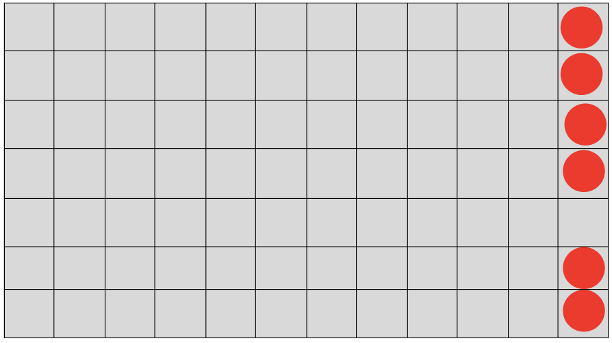 And click on the play button|The enemies should follow the arrow 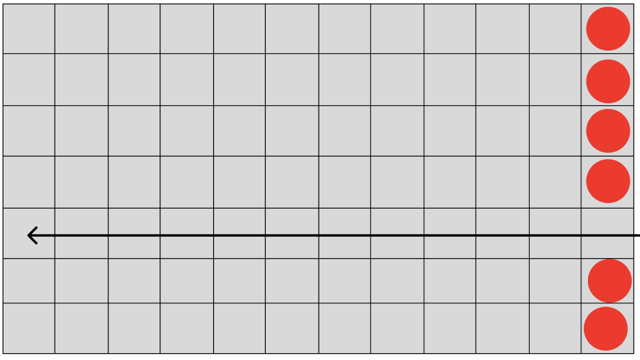|To do|
|10|**Reload** the game then **place** tower like that 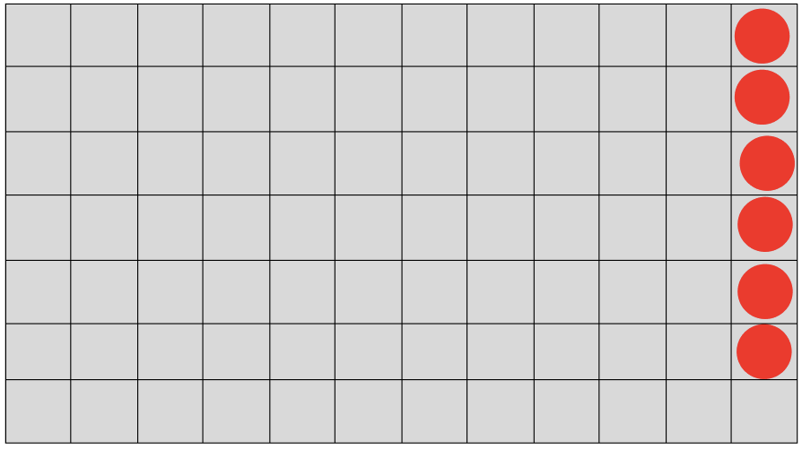 And click on the play button|The enemies should follow the arrow 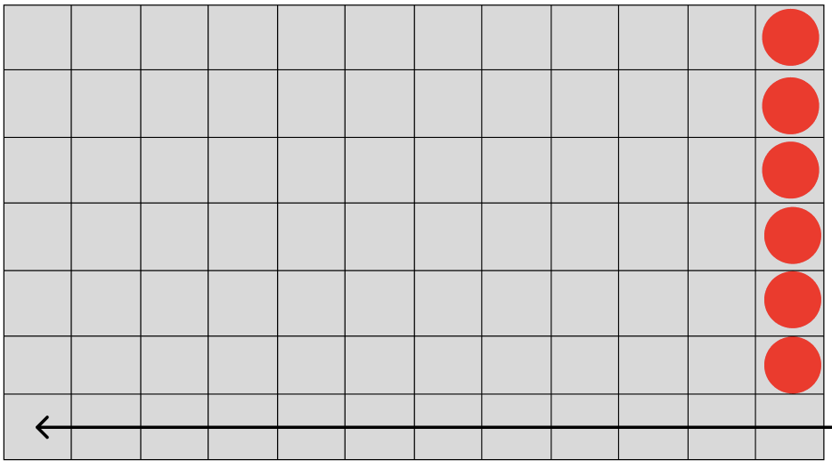|To do|
|11|**Reload** the game then **place** tower like that 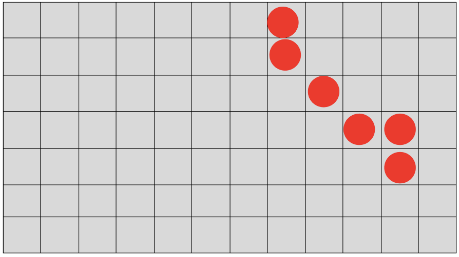 And click on the play button|The enemies should follow the arrow 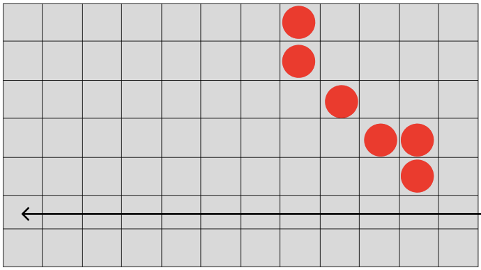|To do|
|12|**Reload** the game then **place** tower like that 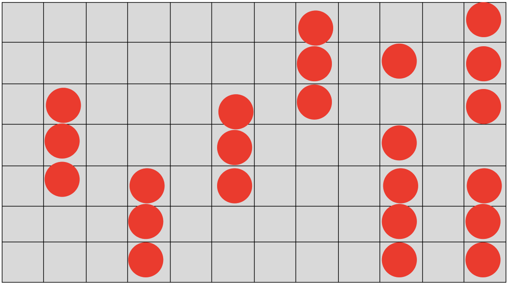 And click on the play button|The enemies should follow the arrow 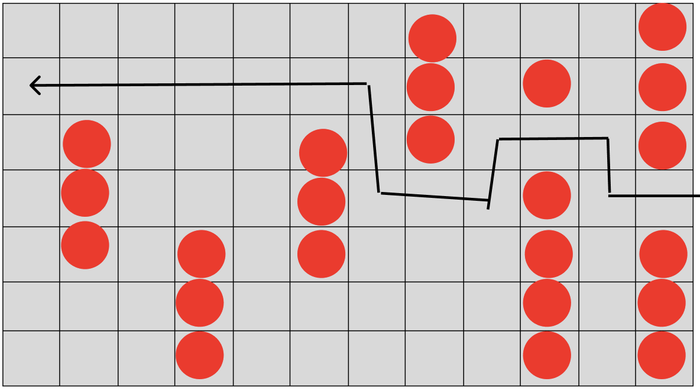|To do|

**Expected Results**: All actions should result in the expected behaviour of the enemies without any unwanted behaviour.

## Tower Attacks 005

**Test Case ID**: 005

**Test Title**: Tower attacks

**Environment**: UnReal 4.27

**Preconditions**: Load into the game with the following settings: Wave 1, set-up phase 

**Test Steps**:

|Step|Instructions|Expected behaviour|Status|
|----|------------|------------------|------|
|1|**Place** an **Archer Tower** in the middle of the grid.|An archer tower should be placed|To do|
|2|**Click** on the **Start** button|Goblins should arrive|Todo|
|3|**Observe** if the tower attack the enemies|The tower should throw projectile at enemies|To do|
|4|**Count** the number of projectile a **goblin** receive before dying|It should receive 6 projectiles (Damage = 10, Goblin HP = 60)|To do|
|5|**Observe** if the wave finishes by itself|When there are no more enemies on the grid, the wave should stop and go to the next set-up phase|To do|
|5|**Quit** and **reload** the game|You should arrive on the first set-up phase of a game|To do|
|6|**Place** an **Bomb Tower** in the middle of the grid.|A bomb tower should be placed|To do|
|7|**Click** on the **Start** button|Goblins should arrive|Todo|
|8|**Observe** if the tower attack the enemies|The tower should throw projectile at enemies|To do|
|9|**Count** the number of projectile a **goblin** receive before dying|It should receive 4 projectiles (Damage = 15, Goblin HP = 60)|To do|
|10|**Observe** if the wave finishes by itself|When there are no more enemies on the grid, the wave should stop and go to the next set-up phase|To do|

**Expected Results**: All actions should result in the expected movements without unwanted behaviour.

## Castle destroy 006

**Test Case ID**: 006

**Test Title**: Castle destroy

**Environment**: UnReal 4.27

**Preconditions**: Load into the game with the following settings: Wave 1, set-up phase finished without a tower

**Test Steps**:

|Step|Instructions|Expected behaviour|Status|
|----|------------|------------------|------|
|1|Let the enemies go to the castle|The goblin should inflict five damage and disappear. The wave should finish when there are no more enemies, and the game should go to the second set-up phase|To do|
|2|**Press** the start button without placing a tower|A new wave should start|To do|
|3|**Repeat** the two previous steps till you lose the game | You should lose the game when the castle has taken 100 damage. The goblin and the skeleton inflict five damage. The game should end with a "Game over" message|To do|

**Expected Results**: All actions should result in the expected movements without unwanted behaviour.

## Pause Test 007

**Test Case ID**: 007

**Test Title**: Pause during the game

**Environment**: UnReal 4.27

**Preconditions**: Load into the game with the following settings: Wave 1, set-up phase

**Test Steps**:

|Step|Instructions|Expected behaviour|Status|
|----|------------|------------------|------|
|1|**Click** on the pause button in the top left of the screen|The pause menu should appear, and the game should be on pause|To do|
|2|**Click** on the resume button|The pause menu should disappear, and the game should restart from where you paused|To do|
|3|**Click** on the play button|A wave should start|To do|
|4|During the wave, **click** on the pause button|The pause menu should appear, and the game should be on pause|To do|
|5|**Click** on the resume button|The pause menu should disappear, and the game should restart from where you paused|To do|

**Expected Results**: All actions should result in the expected movements without unwanted behaviour.

## Keyboard Test 008

**Test Case ID**: 008

**Test Title**: Keyboard test

**Environment**: UnReal 4.27

**Preconditions**: Load into the game with the following settings: Wave 1, set-up phase

**Test Steps**:

|Step|Instructions|Expected behaviour|Status|
|----|------------|------------------|------|
|1|Press the button **²** on a Windows keyboard|Nothing should happen|0.8.0|
|2|Press the button **1** on the Windows keyboard|Nothing should happen|0.8.0|
|3|Press the button **2** on the Windows keyboard|Nothing should happen|0.8.0|
|4|Press the button **3** on the Windows keyboard|Nothing should happen|To do|
|5|Press the button **4** on the Windows keyboard|Nothing should happen|To do|
|6|Press the button **5** on the Windows keyboard|Nothing should happen|0.8.0|
|7|Press the button **6** on the Windows keyboard|Nothing should happen|0.8.0|
|8|Press the button **7** on the Windows keyboard|Nothing should happen|0.8.0|
|9|Press the button **8** on the Windows keyboard|Nothing should happen|0.8.0|
|10|Press the button **9** on the Windows keyboard|Nothing should happen|0.8.0|
|11|Press the button **0** on the Windows keyboard|Nothing should happen|0.8.0|
|12|Press the button **°** on the Windows keyboard|Nothing should happen|0.8.0|
|13|Press the button **+** on the Windows keyboard|Nothing should happen|0.8.0|
|14|Press the button **A** on the Windows keyboard|Nothing should happen|0.8.0|
|15|Press the button **Z** on the Windows keyboard|Nothing should happen|0.8.0|
|16|Press the button **E** on the Windows keyboard|Nothing should happen|0.8.0|
|17|Press the button **R** on the Windows keyboard|Nothing should happen|0.8.0|
|18|Press the button **T** on the Windows keyboard|Nothing should happen|0.8.0|
|19|Press the button **Y** on the Windows keyboard|Nothing should happen|0.8.0|
|20|Press the button **U** on the Windows keyboard|Nothing should happen|0.8.0|
|21|Press the button **I** on the Windows keyboard|Nothing should happen|0.8.0|
|22|Press the button **O** on the Windows keyboard|Nothing should happen|0.8.0|
|23|Press the button **P** on the Windows keyboard|Nothing should happen|0.8.0|
|24|Press the button **¨** on the Windows keyboard|Nothing should happen|0.8.0|
|25|Press the button **£** on the Windows keyboard|Nothing should happen|0.8.0|
|26|Press the button **Q** on the Windows keyboard|Nothing should happen|0.8.0|
|27|Press the button **S** on the Windows keyboard|Nothing should happen|0.8.0|
|28|Press the button **D** on the Windows keyboard|Nothing should happen|0.8.0|
|29|Press the button **F** on the Windows keyboard|Nothing should happen|0.8.0|
|30|Press the button **G** on the Windows keyboard|Nothing should happen|0.8.0|
|31|Press the button **H** on the Windows keyboard|Nothing should happen|0.8.0|
|32|Press the button **J** on the Windows keyboard|Nothing should happen|0.8.0|
|33|Press the button **K** on the Windows keyboard|Nothing should happen|0.8.0|
|34|Press the button **L** on the Windows keyboard|Nothing should happen|0.8.0|
|35|Press the button **M** on the Windows keyboard|Nothing should happen|0.8.0|
|36|Press the button **%** on the Windows keyboard|Nothing should happen|0.8.0|
|37|Press the button **µ** on the Windows keyboard|Nothing should happen|0.8.0|
|38|Press the button **<** on the Windows keyboard|Nothing should happen|0.8.0|
|39|Press the button **W** on the Windows keyboard|Nothing should happen|0.8.0|
|40|Press the button **X** on the Windows keyboard|Nothing should happen|0.8.0|
|41|Press the button **C** on the Windows keyboard|Nothing should happen|0.8.0|
|42|Press the button **V** on the Windows keyboard|Nothing should happen|0.8.0|
|43|Press the button **B** on the Windows keyboard|Nothing should happen|0.8.0|
|44|Press the button **N** on the Windows keyboard|Nothing should happen|0.8.0|
|45|Press the button **?** on the Windows keyboard|Nothing should happen|0.8.0|
|46|Press the button **.** on the Windows keyboard|Nothing should happen|To do|
|47|Press the button **/** on the Windows keyboard|Nothing should happen|0.8.0|
|48|Press the button **$** on the Windows keyboard|Nothing should happen|0.8.0|
|49|Press the button **→** on the Windows keyboard|Nothing should happen|0.8.0|
|50|Press the button **←** on the Windows keyboard|Nothing should happen|0.8.0|
|51|Press the button **↑** on the Windows keyboard|Nothing should happen|0.8.0|
|52|Press the button **↓** on the Windows keyboard|Nothing should happen|0.8.0|
|53|Press the button **⏎** on the Windows keyboard|Nothing should happen|0.8.0|
|53|Press the **space bar** on the Windows keyboard|Nothing should happen|0.8.0|

**Expected Results**: All button presses should result in the expected movements without unwanted behaviour.

## Place Spell Card 09

**Test Case ID**: 09

**Test Title**: Place spell card

**Environment**: UnReal 4.27

**Preconditions**: Load into the game with the following settings: Wave 1, set-up phase finished

**Test Steps**:

|Step|Instructions|Expected behaviour|Status|
|----|------------|------------------|------|
|1|**Click** on a tower card|The card should go to the left|To do|
|2|**Click** on the grid to lace the tower|A tower should be placed in the square you clicked on|To do|
|3|**Click** on a spell card|The card should go to the left|To do|
|4|**Click** on the tower|The tower should be affects by the card|To do|
|5|**Click** on a spell card|The card should go to the left|To do|
|6|**Click** on the grid, where there is no tower or enemies|the card should affect the zone|To do|
|7|**Click** on a spell card|The card should go to the left|To do|
|8|**Click** on an enemie|The card should affects the enemie|To do|
|9|**Click** on a spell card|The card should go to the left|To do|
|10|**Click** where there are multiple enemies|The card should affects the enemies|To do|

**Expected Results**: All actions should result in the expected movements without unwanted behaviour.

## Get New Cards 010

**Test Case ID**: 010

**Test Title**: Get new cards

**Environment**: UnReal 4.27

**Preconditions**: Load into the game with the following settings: Wave 1, set-up phase

**Test Steps**:

|Step|Instructions|Expected behaviour|Status|
|----|------------|------------------|------|
|1|**Check** the number of cards|You should have 7 cards|0.8.0|
|2|Click on the **new wave** button|A wave should start and end when there are no more enemies|0.8.0|
|3|**Observe** the cards|Your previous cards should have been replaced by 7 new ones|0.8.0|
|4|**Place** a tower card on the grid|A tower should appear|0.8.0|
|5|**Observe** the cards|Your previous cards should have been replaced by 7 new ones|0.8.0|

**Expected Results**: All actions should result in the expected movements without unwanted behaviour.

## Damage saved 011

**Test Case ID**: 011

**Test Title**: Damage saved

**Environment**: UnReal 4.27

**Preconditions**: Load into the game with the following settings: Wave 2, set-up phase finished

**Test Steps**:

|Step|Instructions|Expected behaviour|Status|
|----|------------|------------------|------|
|1|Let the enemies go to the castle|Enemies should go to the castle and inflict damage. You should arrive to the second set-up phase|To do|
|2|Check the **number of health point** of the castle|It should be (100 - number of enemies*5)|To do|
|3|Click on the **next wave** button|A new wave should start|To do|
|4|Let the enemies go to the castle|Enemies should go to the castle and inflict damage. You should arrive to the third set-up phase|To do|
|5|Check the **number of health point** of the castle|It should be (100 - number of enemies*5)|To do|
|6|Click on the **pause** buttton|The pause menu should open|To do|
|7|Click on the **main menu** button|You should arrive in the main menu|To do|
|8|Click on the **continue** button|You should arrive on the third set-up phase and having the same number of health points on the castle as before.|To do|
|9|**Close** the game and **reopen** it|The game should close and open to the main menu|To do|
|10|Click on the **continue** button|You should arrive on the third set-up phase and having the same number of health points on the castle as before.|To do|

**Expected Results**: All actions should result in the expected movements without unwanted behaviour.

## Mana Management 012

**Test Case ID**: 012

**Test Title**: Mana management

**Environment**: UnReal 4.27

**Preconditions**: Load into the game with the following settings: Wave 1, set-up phase, have three mana

**Test Steps**:

|Step|Instructions|Expected behaviour|Status|
|----|------------|------------------|------|
|1|**Spend** the three mana on a card and place it on the grid|Your mana should be at zero mana and have a tower placed|0.8.0|
|2|Try to **place** another tower|Nothing should happen|0.8.0|
|2|**Pass** the wave and **observe** how mana you have at the new set-up phase|You should have four mana|0.8.0|
|3|**Quit** the game and **restart** it|You should restart at the beginning of the game|0.8.0|
|4|**Don't** spend mana and **pass** the wave|You should have four mana during the second set-up phase|0.8.0|

**Expected Results**: All actions should result in the expected movements without unwanted behaviour.

## Menu Navigation 013

**Test Case ID**: 013

**Test Title**: Menu navigation

**Environment**: UnReal 4.27

**Preconditions**: Load into the game with the following settings: Main menu

**Test Steps**:

|Step|Instructions|Expected behaviour|Status|
|----|------------|------------------|------|
|1|Click on the **Quit** button|The game should close|To do|
|2|**Reopen** the game|You should arrive on the main menu|To do|
|3|Click on the **New Game** button|The game should start, and you should arrive on the first set-up phase|To do|
|4|Click on the **pause** button|The game should be in pause, and the pause menu should appear|To do|
|5|Click on the **resume** button|You should arrive at the same set-up phase as before|To do|
|6|Click on the **pause** button|The game should be in pause, and the pause menu should appear|To do|
|7|Click on the **settings** button|You should arrive in the settings|To do|
|8|Clisk on the **return** button|You should be back to the pause menu|To do|
|9|Click on the **main page** button|You should arrive on the main page|To do|

**Expected Results**: All actions should result in the expected movements without unwanted behaviour.