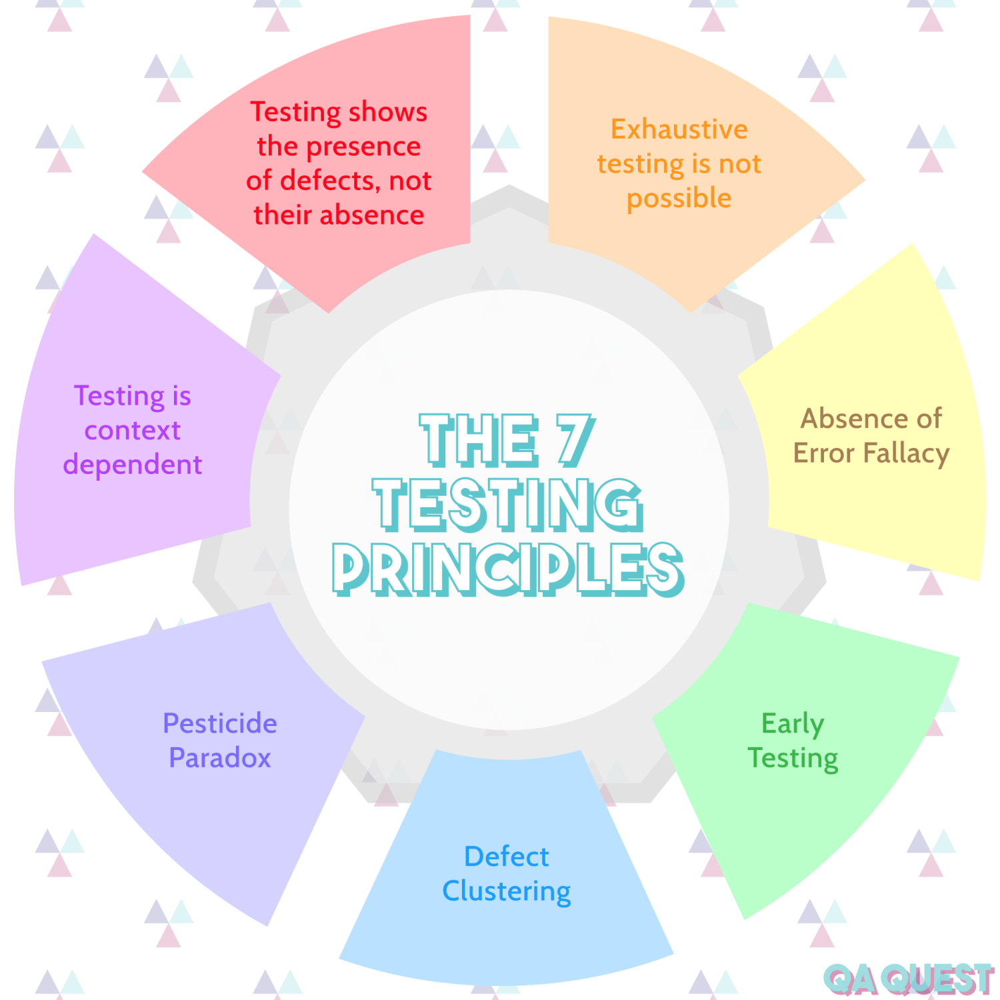

**
The Card Kingdom
**
**
Test Plan
**

Clémentine Curel

 

**
Team:
**

Jason GROSSO, Aurélien Fernandez, Victor LEROY, Clément CATON

 

 ALGOSUP, Group 6. All Rights Reserved. 

Table of content

- [Scope of Testing](#scope-of-testing)
- [Risk Analysis](#risk-analysis)
- [Scheduling and Test Approach](#scheduling-and-test-approach)
  - [Pre-production phase: 27/02/2022 -\> 10/03/2023](#pre-production-phase-27022022---10032023)
  - [Production phase: 13/03/2023 -\> 14/04/2023](#production-phase-13032023---14042023)
- [Testing Tools](#testing-tools)
  - [Hardware](#hardware)
  - [Software](#software)
- [Defect Management](#defect-management)
- [Test Cases](#test-cases)
- [Footnotes](#footnotes)

The following report outlines the steps to perform the necessary QA testing during the different testing phases of The Card Kingdom project.

The main goal of game testing is to identify and discover defects and bugs in a video game and improve its stability and performance. Game testing is a component of game development that helps to ensure the video game to be deployed is bug-free.

# Scope of Testing

This test plan was designed to test the game "The Card Kingdom". It covers the UI/UX[^uixi], the mechanics, the code, the tests, and the game itself. 

|Test zone|Activities|To ensure|
|---------|----------|---------|
|UI / UX|||
||Accessibility|People with disabilities can play|
||Comprehension|Easy to understand what can be done|
||User-friendly|Avoid complex features|
||Design|Coherent design|
||Controls|Easy to manupulate|
||Menu|Less than 3 click to go from a menu to an other|
|||Access the game, leave the game, settings|
|Game|||
||Castle|Health points|
||Deck of cards|Modify and remove cards|
||Cards|Choose, place|
||Spells|Attacks, place|
||Towers|Attacks, Health points, position|
||Enemies|Pathfinding[^path], attacks, health points|
||Pathfinding[^path]|Can't block the enemies path|

# Risk Analysis

A well-known problem in testing is that you’re never going to be able to test everything. 

These are the principles that the ISTQB[^istqb] has compiled and established over the years as testing and software development have evolved, and they are recognized as the absolute core of testing.

Taking all the previous information, and also that is the first version of the game, here are the most important features to test:

|Index|Feature|why|
|-----|-------|---|
|1|Towers|Ensure their damage area and the damage they inflict|
|2|Cards|The cards need to be explicit and give the right tower or spell|
|3|Controls|The player has to find it easy to use and not struggle to choose a card and place it|
|4|Enemies|Ensure their pathfinding[^path], their health points and movments|
|5|Comprehension|If the player doesn't understand what he can do, he will be annoyed and never play the game|

# Scheduling and Test Approach

The test plan takes place in the pre-production and production phase.

It started on Monday, 27th of February 2023 and will end on Friday, 14th of April 2023.

## Pre-production phase: 27/02/2022 -> 10/03/2023

During this phase, the testing will be on the mechanics and dynamics of the game to ensure that the game is coherent.
The testing approaches for this phase are localisation playtesting and user acceptance playtesting.

|Name|Description|When to use|
|----|-----------|-----------|
|Localisation game testing |This method ensures usability, understandability and enjoyability for players in different countries and cultures. |Pre-production, game launch|
|User acceptance game testing|Big issues are rarely found, so the focus is mostly on polishing any remaining minor bugs and making small improvements to the user experience.|Beta test[^beta]|

## Production phase: 13/03/2023 -> 14/04/2023

During this phase, the testing will be on the game development. This phase will be in two distinct parts the first will be on the white box testing[^white] and the second on the black box testing[^black].

Through the white bow testing, three methods:

|Name|Description|When to use|
|----|-----------|-----------|
|Open for testing|Signal when a feature is open for testing by marking them with an "oft" after the name|Always|
|Smoke testing|Smoke testing is all about verifying stability after a code update|Every day of the project|
|Regression game testing|Make sure that the update has not adversely affected existing functionality|During development, post-launch period|

By identifying the part of the code for each defect, a Pareto[^pareto] can help to identify the 20% of components which are generating 80% of the defect.

# Testing Tools

## Hardware

- macOS Monterey
  - Version: 12.2.1
  - Chip: Apple M1
  - 2560 x 1600
- Lenovo
  - Windows 11
  - 1920 x 1080

## Software

- [Modl](https://modl.ai/)
  - modl : test
  - Exploratory Bot
  - Diverse states and events
  - UnReal plugin
  - Detailed report
  - Will be used to detect bugs or unwanted functionalities.
  - Example: Determine if there is a problem in the positioning of the towers, or in the attacks.

- [Machinations](https://machinations.io/)

  - Flowcharts to predict the game economics and system
  - Will be used to test the balance of the game.
  - Example: Determine if there is enough resources (mana[^mana]) at the start of a wave.

- [Gameanalytics](https://gameanalytics.com/)
	- Organisations of the data found thanks to the testing.

- [UnReal](https://www.unrealengine.com/en-US/solutions/games)
	- Game engine
	- Version: 4.27

# Defect Management

To report bugs or defects effectively found in the project, a markdown file named "[Bug Database](https://github.com/algosup/2022-2023-project-4-game-design-Team-6/blob/Test/BugDatabase.md)" has been created. 

For each report, this information will be needed:
- Index

- Reporter
    - The person reporting the issue

- Date
    - The date of the report

- Description
    - Description of the bug, as detailed as possible

- Component
    - From where the bug comes from
    - Example: towers, enemies
    - Help to see where the majority of issues are coming from.

- Steps
    - Steps detailed as much as possible

- Assignee

- Status
    - If the problem is 
    	- To do
        - Open
        - In progress
        - Closed
        - Cancel

- Severity
    - None -> Doesn't impact the project at all
    - Low -> Small impact, 
    - Medium -> Impact a single feature
    - Major -> Crash the game or question a feature

- Additional content
    - Screenshots
    - Videos
    - Additional information

# Test Cases

All the test cases are in the markdown file [TestCases.md.](https://github.com/algosup/2022-2023-project-4-game-design-Team-6/blob/Test/TestCases.md)

# Footnotes

[^smart]: A SMART objective is one that is specific, measurable, achievable, relevant, and time-bound.

[^qa]: Quality Assurance

[^uiux]: UI (user interface) deals with the interaction between users and software. UX (user experience) deals with a user's overall experience with the product.

[^path]: Pathfinding is the plotting, by a computer application, of the shortest route between two points.

[^istqb]: The International Software Testing Qualifications Board is a software testing certification board that operates internationally.

[^white]: White box testing is a form of application testing that provides the tester with complete knowledge of the application being tested, including access to source code and design documents.

[^black]: Black box testing involves testing a system with no prior knowledge of its internal workings.

[^beta]: Beta testing is an opportunity for real users to use a product in a production environment to uncover any bugs or issues before a general release.

[^pareto]: The Pareto principle states that for many outcomes, roughly 80% of consequences come from 20% of causes.

[^ai]: AI stands for "Artificial Intelligence". It refers to the simulation of human intelligence in machines that are programmed to think and learn like humans.

[^mana]: This is a form of money on the game to be able to buy card during waves.

