

**
The Card Kingdom
**
**
Test Cases
**

Clémentine Curel

 

**
Team:
**

Jason GROSSO, Aurélien Fernandez, Victor LEROY, Clément CATON

 

 ALGOSUP, Group 6. All Rights Reserved. 

Table of content

- [Test Cases](#test-cases)
  - [Cards Navigation 001](#cards-navigation-001)
  - [Place Tower Card 002](#place-tower-card-002)
  - [Enemies Coming 003](#enemies-coming-003)
  - [Enemies path 004](#enemies-path-004)
  - [Tower Attacks 005](#tower-attacks-005)
  - [Castle destroy 006](#castle-destroy-006)
  - [Pause Test 007](#pause-test-007)
  - [Save Test 008](#save-test-008)
  - [Keyboard Test 009](#keyboard-test-009)
  - [Place Spell Card 010](#place-spell-card-010)
  - [Get New Cards 011](#get-new-cards-011)
  - [Damage saved 012](#damage-saved-012)
  - [Mana Management 013](#mana-management-013)
  - [Menu Navigation 014](#menu-navigation-014)

# Test Cases

## Cards Navigation 001 

**Test Case ID**: 001

**Test Title**: Cards navigation

**Environment**: UnReal 4.27

**Preconditions**: Load into the game with the following settings: Wave 1, set-up phase

**Test Steps**:

|Step|Instructions|Expected behaviour|Status|
|----|------------|------------------|------|
|1|Observe the cards **without touching** them|Nothing should happen|To do|
|2|**Left** click on the first card (**short press**)|The card should teleport itself to the middle left of the screen and be bigger|To do|
|3|**Left** click on the same card (**short press**)|The card must return to its initial place and be smaller|To do|
|4|**Right** click on a card (**short press**)|The card should do nothing|To do|
|5|**Left** click on the last card (**short press**)|The card should teleport itself to the middle left of the screen and be bigger|To do|
|6|**Left** click on another card (**short press**)|The first card must return to its initial place and be smaller. The second card must be at the middle right of the screen and be bigger|To do|
|7|**Hovering** the card with the cursor|Nothing should happen|To do|
|8|**Left** click on a card (**long press**)|The card should teleport itself to the middle left of the screen and be bigger|To do|
|9|**Left** click on another card (**long press**)|The first card must return to its initial place and be the same size as the other. The second card must be at the middle left of the screen and be bigger|To do|
|10|**Left** click on the card selected(on right)(**long press**)|The card must return to its original place and have its original size|To do|
|11|**Double left** click on a card with a card under|The first card must go to the middle left and be bigger, followed by the card under, and the first card should return to its initial place with its initial size|To do|
|12|**Double left** click on the selected card|The card must return to its initial place with the initial size|To do|
|13|**Double left** click on a card with no card under|The card must go to the left and be bigger|To do|

**Expected Results**: All actions should result in the expected movements without any unwanted behaviour.

##  Place Tower Card 002

**Test Case ID**: 002

**Test Title**: Place tower card

**Environment**: UnReal 4.27

**Preconditions**: Load into the game with the following settings: Wave 1, set-up phase

**Test Steps**:

|Step|Instructions|Expected behaviour|Status|
|----|------------|------------------|------|
|1|**Left** click on a card (**short press**)|The card should teleport itself to the middle right of the screen and be bigger|To do|
|2|**Hovering** the grid|Nothing will happen|To do|
|3|**Left** click on a random case on the grid(**short press**)|A tower must appear in the case clicked|To do|
|4|**Left** click on a card|The card should teleport itself to the middle right of the screen and be bigger|To do|
|5|**Left** click on the previous case occupied by a tower| Nothing should happen|To do|
|6|**Left** click on a random case of the grid|A tower must appear in the case clicked|To do|
|7|Try to **drag** a tower|Nothing should happen|To do|
|8|**Left** click on a tower|Nothing should happen|To do|
|9|**Double left** click on a tower|Nothing should happen|To do|
|10|**Right** click on a tower|Nothing should happen|To do|

**Expected Results**: All actions should result in the expected movements without any unwanted behaviour.

## Enemies Coming 003

**Test Case ID**: 003

**Test Title**: Enemies coming

**Environment**: UnReal 4.27

**Preconditions**: Load into the game with the following settings: Wave 1, set-up phase whithout tower

**Test Steps**:

|Step|Instructions|Expected behaviour|Status|
|----|------------|------------------|------|
|1|**Right** click on the play button|Nothing should happen|To do|
|2|**Left** click on the play button|Sounds to let us know it starts, five new cards appears on your deck|To do|
|3|**Wait** and click on **nothing**|The enemies should start to arrive|To do|
|4|**Left** click on enemies|Nothing should change. The enemies should continue to move straight forward to the castle and disappear when leaving the grid|To do|
|5|**Double left** click on enemies|Nothing should change. The enemies should continue to move straight forward to the castle and disappear when leaving the grid|To do|
|6|**Right** click on enemies|Nothing should change. The enemies should continue to move straight forward to the castle and disappear when leaving the grid|To do|

**Expected Results**: All actions should result in the expected movements without any unwanted behaviour.

## Enemies path 004

**Test Case ID**: 004

**Test Title**: Enemies path

**Environment**: UnReal 4.27

**Preconditions**: Load into the game with the following settings: Wave 1, set-up phase

**Test Steps**:

|Step|Instructions|Expected behaviour|Status|
|----|------------|------------------|------|
|1|**Place** tower like that 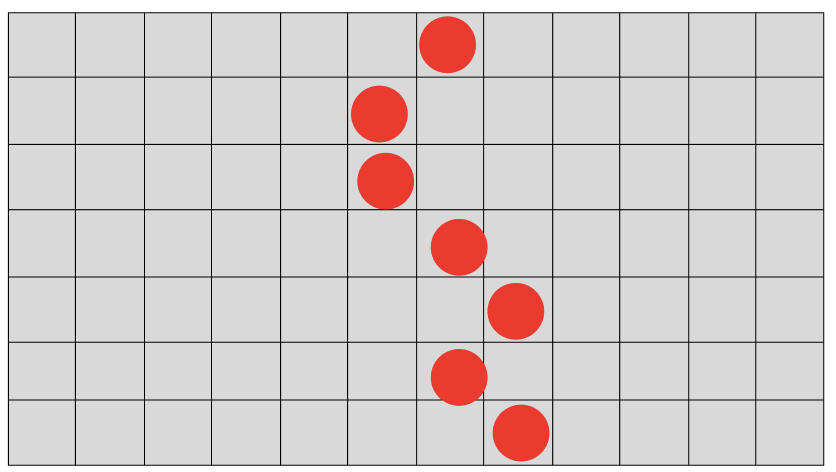 And click on the play button|You musn't be able to do it|To do|
|2|**Reload** the game then **place** tower like that 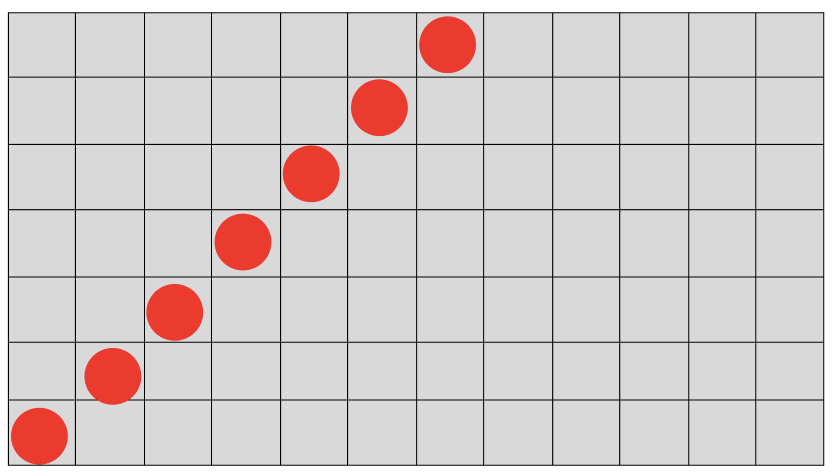 And click on the play button|You musn't be able to do it|To do|
|3|**Reload** the game then **place** tower like that 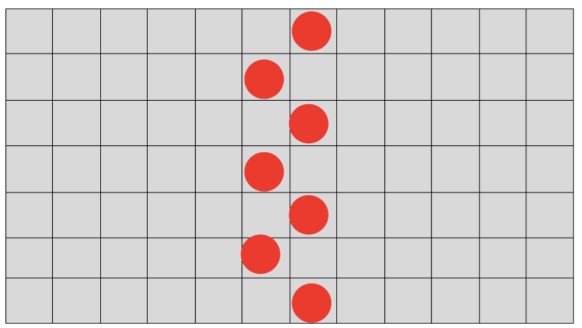 And click on the play button|You musn't be able to do it|To do|
|4|**Reload** the game then **place** tower like that 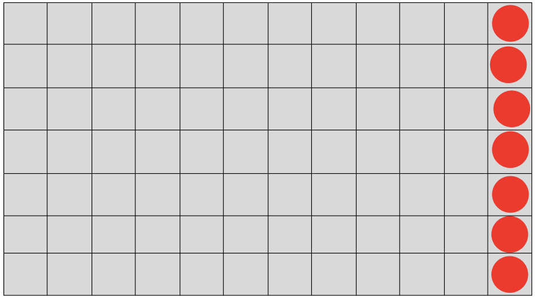 And click on the play button|You musn't be able to do it|To do|
|5|**Reload** the game then **place** tower like that  And click on the play button|You musn't be able to do it|To do|
|6|**Reload** the game and **place** tower like that 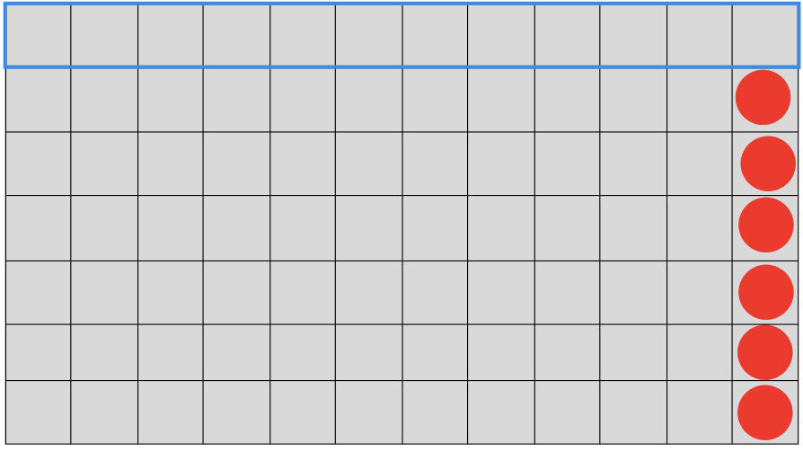 And click on the play button|The enemies should follow the arrow 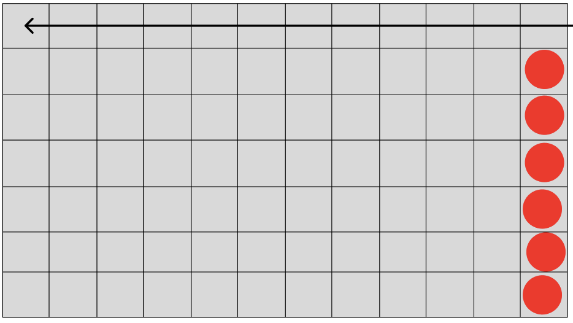|To do|
|7|**Reload** the game then **place** tower like that 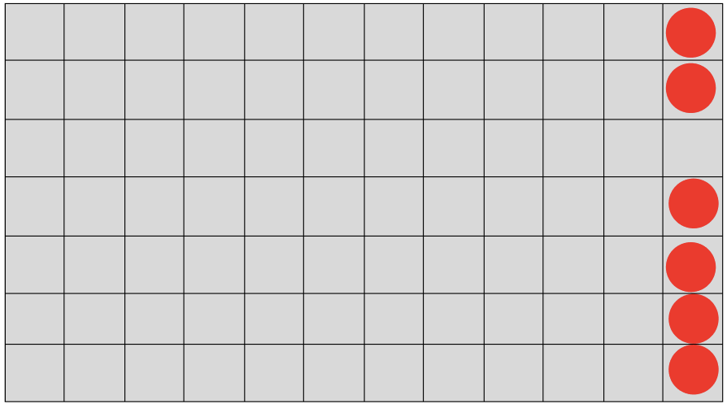 And click on the play button|The enemies should follow the arrow 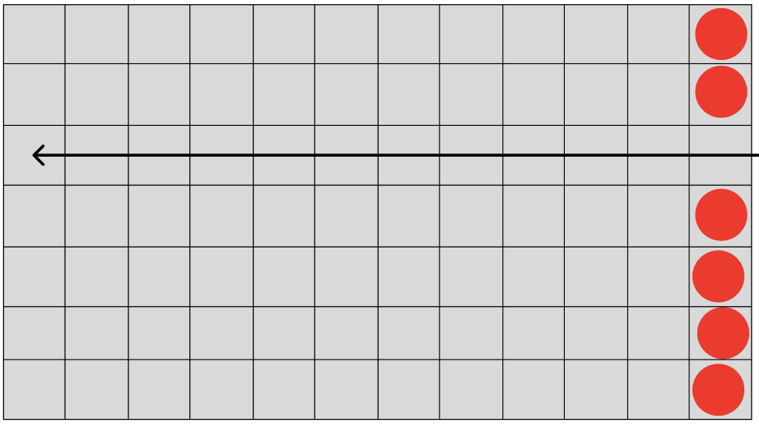|To do|
|8|**Reload** the game then **place** tower like that 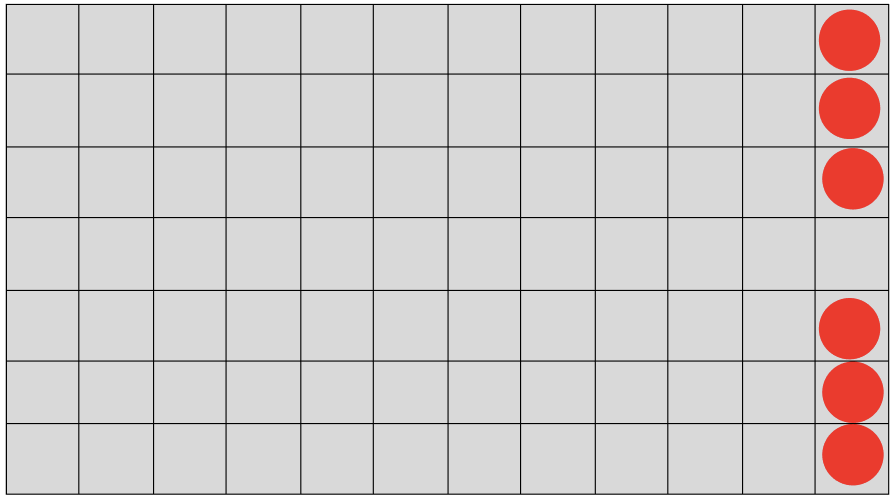 And click on the play button|The enemies should follow the arrow 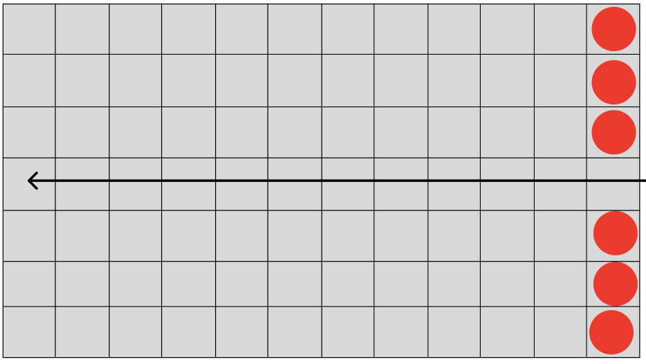|To do|
|9|**Reload** the game then **place** tower like that 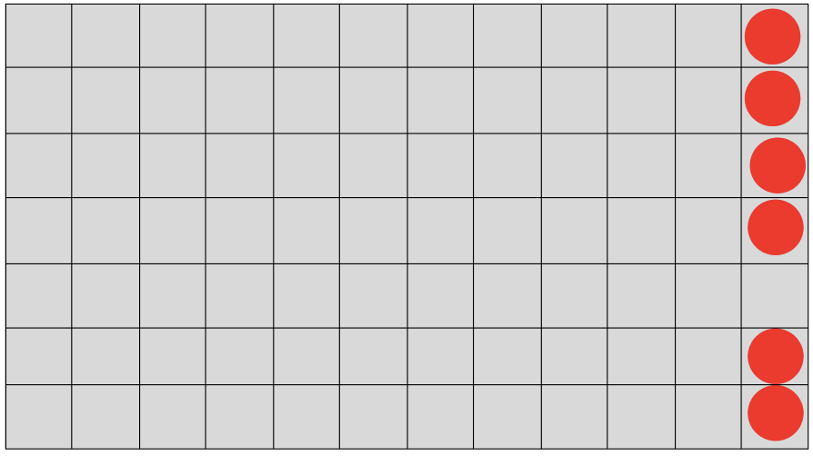 And click on the play button|The enemies should follow the arrow 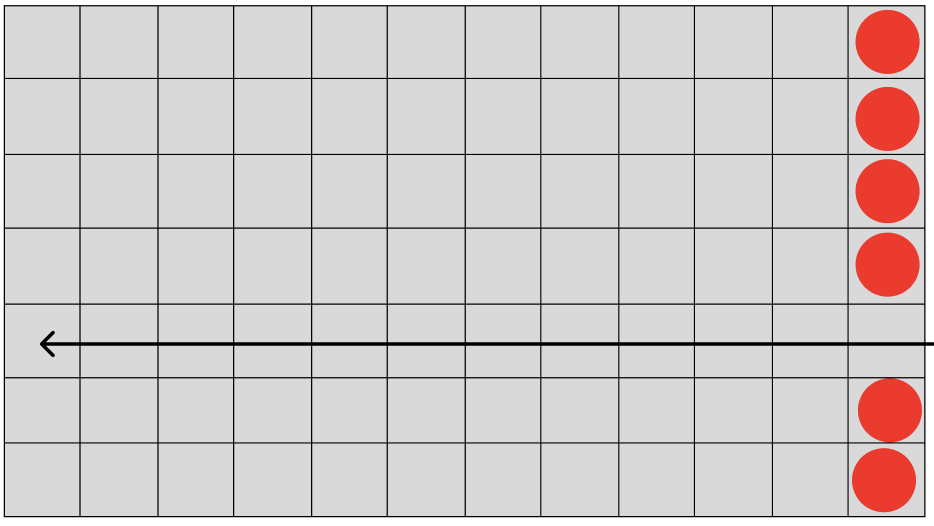|To do|
|10|**Reload** the game then **place** tower like that 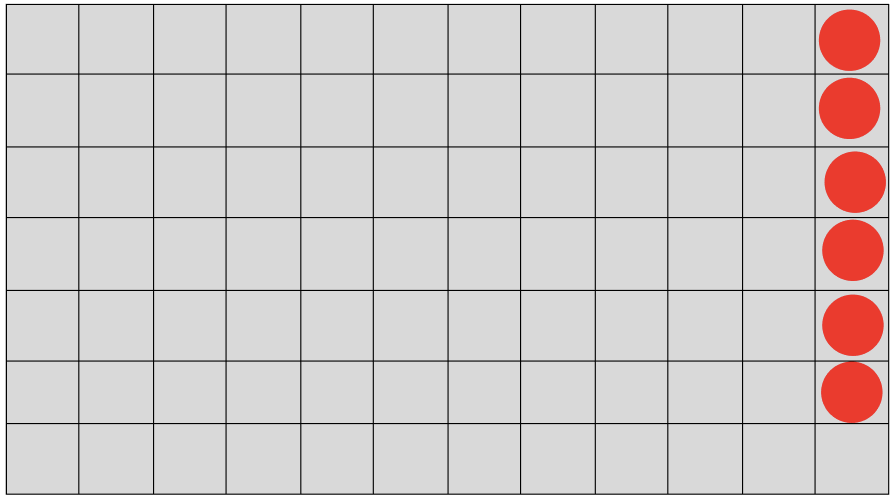 And click on the play button|The enemies should follow the arrow 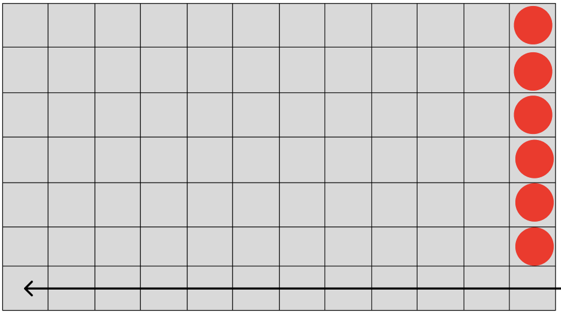|To do|
|11|**Reload** the game then **place** tower like that 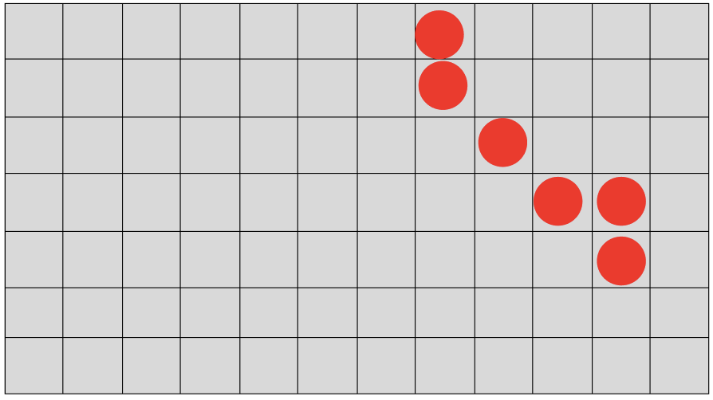 And click on the play button|The enemies should follow the arrow 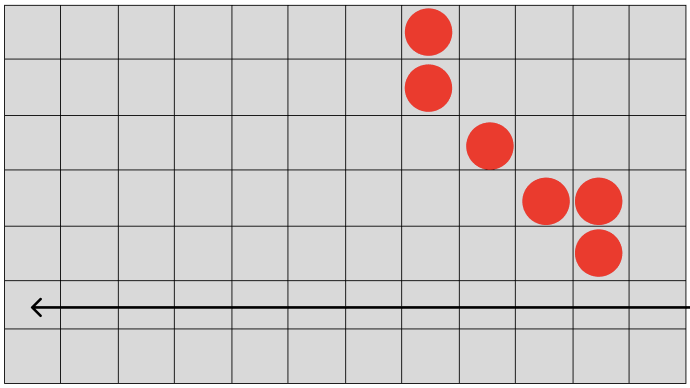|To do|
|12|**Reload** the game then **place** tower like that 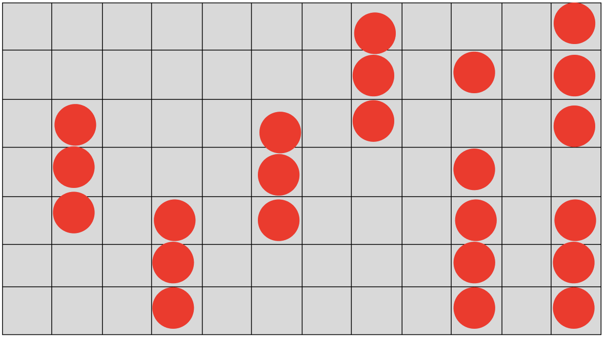 And click on the play button|The enemies should follow the arrow 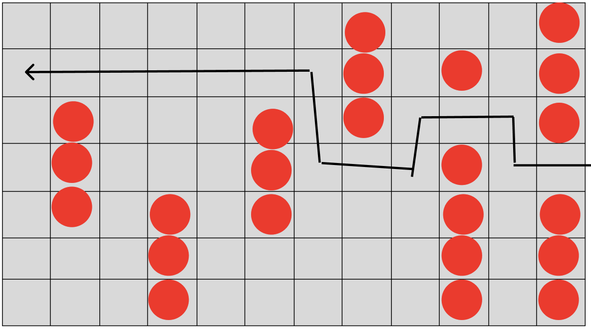|To do|

**Expected Results**: All actions should result in the expected behaviour of the enemies without any unwanted behaviour.

## Tower Attacks 005

**Test Case ID**: 005

**Test Title**: Tower attacks

**Environment**: UnReal 4.27

**Preconditions**: Load into the game with the following settings: Wave 1, set-up phase 

**Test Steps**:

|Step|Instructions|Expected behaviour|Status|
|----|------------|------------------|------|
|1|**Place** an **Archer Tower** in the middle of the grid.|An archer tower should be placed|To do|
|2|**Click** on the **Start** button|Goblins should arrive|Todo|
|3|**Observe** if the tower attack the enemies|The tower should throw projectile at enemies|To do|
|4|**Count** the number of projectile a **goblin** receive before dying|It should receive 6 projectiles (Damage = 10, Goblin HP = 60)|To do|
|5|**Observe** if the wave finish by itself|When there is no more enemies on the grid, the wave shoul stop and go to the next set up phase|To do|
|5|**Quit** and **reload** the game|You shoul arrive on the first set up phase of a game|To do|
|6|**Place** an **Bomb Tower** in the middle of the grid.|A bomb tower should be placed|To do|
|7|**Click** on the **Start** button|Goblins should arrive|Todo|
|8|**Observe** if the tower attack the enemies|The tower should throw projectile at enemies|To do|
|9|**Count** the number of projectile a **goblin** receive before dying|It should receive 4 projectiles (Damage = 15, Goblin HP = 60)|To do|
|10|**Observe** if the wave finish by itself|When there is no more enemies on the grid, the wave shoul stop and go to the next set up phase|To do|

**Expected Results**: All actions should result in the expected movements without any unwanted behaviour.

## Castle destroy 006

**Test Case ID**: 006

**Test Title**: Castle destroy

**Environment**: UnReal 4.27

**Preconditions**: Load into the game with the following settings: Wave 1, set-up phase finished without tower

**Test Steps**:

|Step|Instructions|Expected behaviour|Status|
|----|------------|------------------|------|
|1|Let the enemies go to the castle|The enemies should inflict damage to the castle and disappear. One goblin inflicts five damage. The wave should finish when there are no more enemies and the game should go to the second set up phase|To do|
|2|**Press** the start button without placing a tower|A new wave should start|To do|
|3|**Repeat** the two previous steps till you lose the game | You should lose the game when the castle has taken 100 damage. The goblin and the skeleton inflict 5 damage. The game should end with a "Game over" message|To do|

**Expected Results**: All actions should result in the expected movements without any unwanted behaviour.

## Pause Test 007

**Test Case ID**: 007

**Test Title**: Pause during the  game

**Environment**: UnReal 4.27

**Preconditions**: Load into the game with the following settings: Wave 1, set-up phase

**Test Steps**:

|Step|Instructions|Expected behaviour|Status|
|----|------------|------------------|------|
|1|**Click** on the pause button in the top left of the screen|The pause menu should appear, and the game should be on pause|To do|
|2|**Click** on the resume button|The pause menu should disappear, and the game should restart from where you paused|To do|
|3|**Click** on the play button|A wave should start|To do|
|4|During the wave, **click** on the pause button|The pause menu should appear, and the game should be on pause|To do|
|5|**Click** on the resume button|The pause menu should disappear, and the game should restart from where you paused|To do|

**Expected Results**: All actions should result in the expected movements without any unwanted behaviour.

## Save Test 008

**Test Case ID**: 008

**Test Title**: Save test

**Environment**: UnReal 4.27

**Preconditions**: Load into the game with the following settings: Wave 1, set-up phase

**Test Steps**:

|Step|Instructions|Expected behaviour|Status|
|----|------------|------------------|------|

**Expected Results**: All actions should result in the expected movements without any unwanted behaviour.

<!-- saving set up phase -> no -->
<!-- saving during a wave -> ? -->

## Keyboard Test 009

**Test Case ID**: 009

**Test Title**: Keyboard test

**Environment**: UnReal 4.27

**Preconditions**: Load into the game with the following settings: Wave 1, set-up phase

**Test Steps**:

|Step|Instructions|Expected behaviour|Status|
|----|------------|------------------|------|
|1|Press the button **²** on a Windows keyboard|Nothing should happen|To do|
|2|Press the button **1** on the Windows keyboard|Nothing should happen|To do|
|3|Press the button **2** on the Windows keyboard|Nothing should happen|To do|
|4|Press the button **3** on the Windows keyboard|Nothing should happen|To do|
|5|Press the button **4** on the Windows keyboard|Nothing should happen|To do|
|6|Press the button **5** on the Windows keyboard|Nothing should happen|To do|
|7|Press the button **6** on the Windows keyboard|Nothing should happen|To do|
|8|Press the button **7** on the Windows keyboard|Nothing should happen|To do|
|9|Press the button **8** on the Windows keyboard|Nothing should happen|To do|
|10|Press the button **9** on the Windows keyboard|Nothing should happen|To do|
|11|Press the button **0** on the Windows keyboard|Nothing should happen|To do|
|12|Press the button **°** on the Windows keyboard|Nothing should happen|To do|
|13|Press the button **+** on the Windows keyboard|Nothing should happen|To do|
|14|Press the button **A** on the Windows keyboard|Nothing should happen|To do|
|15|Press the button **Z** on the Windows keyboard|Nothing should happen|To do|
|16|Press the button **E** on the Windows keyboard|Nothing should happen|To do|
|17|Press the button **R** on the Windows keyboard|Nothing should happen|To do|
|18|Press the button **T** on the Windows keyboard|Nothing should happen|To do|
|19|Press the button **Y** on the Windows keyboard|Nothing should happen|To do|
|20|Press the button **U** on the Windows keyboard|Nothing should happen|To do|
|21|Press the button **I** on the Windows keyboard|Nothing should happen|To do|
|22|Press the button **O** on the Windows keyboard|Nothing should happen|To do|
|23|Press the button **P** on the Windows keyboard|Nothing should happen|To do|
|24|Press the button **¨** on the Windows keyboard|Nothing should happen|To do|
|25|Press the button **£** on the Windows keyboard|Nothing should happen|To do|
|26|Press the button **Q** on the Windows keyboard|Nothing should happen|To do|
|27|Press the button **S** on the Windows keyboard|Nothing should happen|To do|
|28|Press the button **D** on the Windows keyboard|Nothing should happen|To do|
|29|Press the button **F** on the Windows keyboard|Nothing should happen|To do|
|30|Press the button **G** on the Windows keyboard|Nothing should happen|To do|
|31|Press the button **H** on the Windows keyboard|Nothing should happen|To do|
|32|Press the button **J** on the Windows keyboard|Nothing should happen|To do|
|33|Press the button **K** on the Windows keyboard|Nothing should happen|To do|
|34|Press the button **L** on the Windows keyboard|Nothing should happen|To do|
|35|Press the button **M** on the Windows keyboard|Nothing should happen|To do|
|36|Press the button **%** on the Windows keyboard|Nothing should happen|To do|
|37|Press the button **µ** on the Windows keyboard|Nothing should happen|To do|
|38|Press the button **<** on the Windows keyboard|Nothing should happen|To do|
|39|Press the button **W** on the Windows keyboard|Nothing should happen|To do|
|40|Press the button **X** on the Windows keyboard|Nothing should happen|To do|
|41|Press the button **C** on the Windows keyboard|Nothing should happen|To do|
|42|Press the button **V** on the Windows keyboard|Nothing should happen|To do|
|43|Press the button **B** on the Windows keyboard|Nothing should happen|To do|
|44|Press the button **N** on the Windows keyboard|Nothing should happen|To do|
|45|Press the button **?** on the Windows keyboard|Nothing should happen|To do|
|46|Press the button **.** on the Windows keyboard|Nothing should happen|To do|
|47|Press the button **/** on the Windows keyboard|Nothing should happen|To do|
|48|Press the button **$** on the Windows keyboard|Nothing should happen|To do|
|49|Press the button **→** on the Windows keyboard|Nothing should happen|To do|
|50|Press the button **←** on the Windows keyboard|Nothing should happen|To do|
|51|Press the button **↑** on the Windows keyboard|Nothing should happen|To do|
|52|Press the button **↓** on the Windows keyboard|Nothing should happen|To do|
|53|Press the button **⏎** on the Windows keyboard|Nothing should happen|To do|
|53|Press the **space bar** on the Windows keyboard|Nothing should happen|To do|

**Expected Results**: All button presses should result in the expected movements without any unwanted behaviour.

## Place Spell Card 010

**Test Case ID**: 010

**Test Title**: Place spell card

**Environment**: UnReal 4.27

**Preconditions**: Load into the game with the following settings: Wave 1, set-up phase finished

**Test Steps**:

|Step|Instructions|Expected behaviour|Status|
|----|------------|------------------|------|

**Expected Results**: All actions should result in the expected movements without any unwanted behaviour.

## Get New Cards 011

**Test Case ID**: 011

**Test Title**: Get new cards

**Environment**: UnReal 4.27

**Preconditions**: Load into the game with the following settings: Wave 2, set-up phase

**Test Steps**:

|Step|Instructions|Expected behaviour|Status|
|----|------------|------------------|------|

**Expected Results**: All actions should result in the expected movements without any unwanted behaviour.
- cards are kept
- auto new crad + 5
- max 20 card
- if > 20 -> card to the discrad pile
- after can thraw card
- Finally if the players's deck is empty, their discard pile is shuffled and put back in the pile.

## Damage saved 012

**Test Case ID**: 012

**Test Title**: Damage saved

**Environment**: UnReal 4.27

**Preconditions**: Load into the game with the following settings: Wave 2, set-up phase finished

**Test Steps**:

|Step|Instructions|Expected behaviour|Status|
|----|------------|------------------|------|
- see if the castle still have the damage take in the previous wave

**Expected Results**: All actions should result in the expected movements without any unwanted behaviour.

## Mana Management 013

**Test Case ID**: 013

**Test Title**: Mana management

**Environment**: UnReal 4.27

**Preconditions**: Load into the game with the following settings: Wave 1, set-up phase finished with towers

**Test Steps**:

|Step|Instructions|Expected behaviour|Status|
|----|------------|------------------|------|

**Expected Results**: All actions should result in the expected movements without any unwanted behaviour.

## Menu Navigation 014

**Test Case ID**: 014

**Test Title**: Menu navigation

**Environment**: UnReal 4.27

**Preconditions**: Load into the game with the following settings: Wave 1, set-up phase finished with towers

**Test Steps**:

|Step|Instructions|Expected behaviour|Status|
|----|------------|------------------|------|

**Expected Results**: All actions should result in the expected movements without any unwanted behaviour.